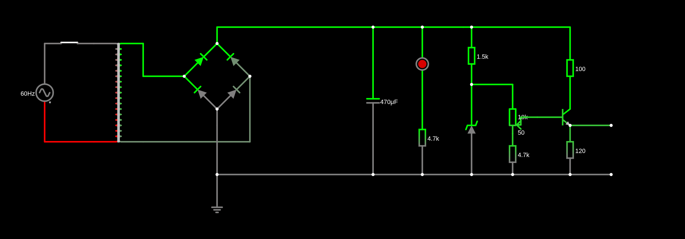
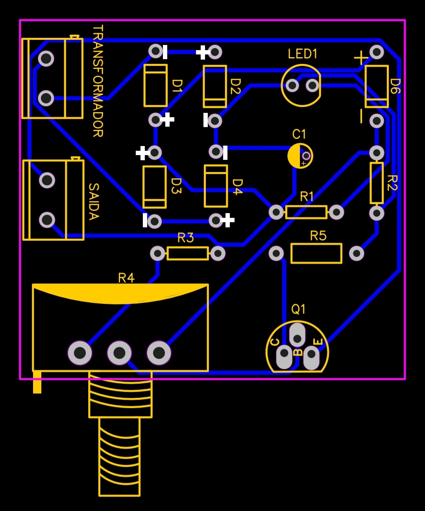
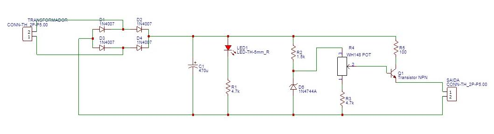

# Fonte Ajustavel
Projeto de uma fonte ajustável para disciplina Eletrônica para Computação USP

## Sobre
Este projeto é um sistema desenvolvido para a disciplina de Eletrônica para Computação na USP - São Carlos. O objetivo é montar uma fonte com tensão ajustável entre 3V e 12V, com capacidade de corrente de até 100mA.

## Circuito no Falstad

## Escolha dos componentes:
| Quantidade | Componentes        | Valor Unitário R$ | Valor Total R$ |
|------------|--------------------|----------|----------|
| 1 | Protoboard | 23,80 | 23,80 |
| 1 | Ponte Retificadora | 4,10 | 4,10 |
| 2 | Capacitor 470uF | 2,80 | 5,60 |
| 1 | Potenciômetro 10k | 7,00 | 7,00 |
| 2 | Transistor NPN | 2,60 | 5,20 |
| 2 | Diodo Zener 13V | 0,50 | 1,00 |
| 10 | Diodo 1N4007 | 0,20 | 2,00 |
| 3 | Resistor 2W 100R | 1,20 | 3,60 |
| 10 | Resistor 1K5 | 0,07 | 0,70 |
| 10 | Resistor 4K7 | 0,07 | 0,70 |
| **Total**  |                    |  | **R$ 53,70** |

## PCB no Eagle

## Esquemático no Eagle

## Vídeo do Projeto 

  <video width="320" height="240" controls>
    <source src="midia/video.mp4" type="video/mp4" />
  </video>

   

## Cálculos

### Parâmetros da Fonte e Relação de Espiras (RTC)

Para simular o circuito, determinamos a relação de transformação do transformador (**Trafo 1**) com base na tensão de pico da rede e na tensão desejada no filtro.

* **Tensão na tomada:** $V_{\text{máx}} = 180\text{ V} \implies V_{\text{RMS}} = 127\text{ V}$
* **Tensão desejada no capacitor:** $V_{\text{cap}} = 24.2\text{ V}$

Considerando a queda de tensão de dois diodos na retificação em ponte ($\approx 1.4\text{ V}$), a fórmula para a Relação de Transformação Completa (RTC) é:

$$\text{RTC} = \frac{V_{\text{máx}}}{V_{\text{cap}} + V_{\text{diodos}}}$$

Substituindo os valores:

$$\text{RTC} = \frac{180}{24.2 + 1.4} = \frac{180}{25.6} \approx 7.04$$

---

### Cálculo dos Resistores

#### LED
* **Corrente nominal do LED ($I_{\text{led}}$):** $5\text{ mA} = 5 \times 10^{-3}\text{ A}$
* **Cálculo da resistência:** $$R_{\text{led}} = \frac{V_{\text{cap}}}{I_{\text{led}}} = \frac{24.2}{5 \times 10^{-3}} = 4840\,\Omega$$

* **Componente comercial sugerido:** **$4.7\text{ k}\Omega$ — $\frac{1}{4}\text{ W}$**

#### Diodo Zener ($13\text{ V}$ — $1\text{ W}$)
* **Potência de operação adotada:** $0.125\text{ W}$
* **Corrente no Zener ($I_{\text{zener}}$):** $$I_{\text{zener}} = \frac{P_{\text{zener}}}{V_{\text{zener}}} = \frac{0.125}{13} \approx 9.62\text{ mA}$$

* **Cálculo do resistor de polarização:** $$R_{\text{zener}} = \frac{V_{\text{zener}}}{I_{\text{zener}}} = \frac{13}{9.62 \times 10^{-3}} \approx 1351\,\Omega$$

* **Componente comercial sugerido:** **$1.5\text{ k}\Omega$ — $\frac{1}{4}\text{ W}$**

#### Potenciômetro
* **Potenciômetro:** **$10\text{ k}$**
* **Resistência em série:** Calculada via simulador *Falstad* para garantir uma faixa de saída próxima a $3\text{ V}$ quando o potenciômetro estiver no ajuste máximo de $10\text{ k}\Omega$.
  * **Componente comercial sugerido:** **$4.7\text{ k}\Omega$ — $\frac{1}{4}\text{ W}$**

### Transistor NPN - 2N2222A 
* **Transistor utilizado:** **2N2222A ($\frac{1}{2}\text{ W}$)**
* **Resistência no Coletor:** Ajustada via *Falstad* para manter a estabilidade na faixa de $12\text{ V}$.
  * **Valor máximo permitido:** **$100\,\Omega$ — $2\text{ W}$**
* **Resistência de Carga (Simulação de Saída):** Para que a saída forneça uma corrente constante de $100\text{ mA}$.

$$R_{\text{carga}} = \frac{12\text{ V}}{100\text{ mA}} = 120\,\Omega$$

  * **Componente comercial sugerido:** **$120\,\Omega$ — $2\text{ W}$**

---

### Ripple e Capacitor

O dimensionamento do capacitor foi feito assumindo um *ripple* máximo tolerável de **10%** e uma resistência equivalente do circuito ($R_{\text{eq}}$) de $220\,\Omega$.

* **Frequência da rede retificada em onda completa ($f$):** $120\text{ Hz}$
* **Tensão de Ripple ($V_{\text{ripple}}$):** $10\% \text{ de } 180\text{ V} = 18\text{ V}$

A equação do capacitor de filtro é dada por:

$$C = \frac{V_{\text{máx}}}{f \times V_{\text{ripple}} \times R_{\text{eq}}}$$

Substituindo os valores do projeto:

$$C = \frac{180}{120 \times 18 \times 220}$$

$$C = \frac{180}{475200} \approx 378.38\,\mu\text{F}$$

* **Componente comercial sugerido:** **$470\,\mu\text{F}$ — $50\text{ V}$**

### Integrantes
Gabriel Augusto Pereira Maia - 18117372  
Chrystian Eloy de Assunção - 18115512