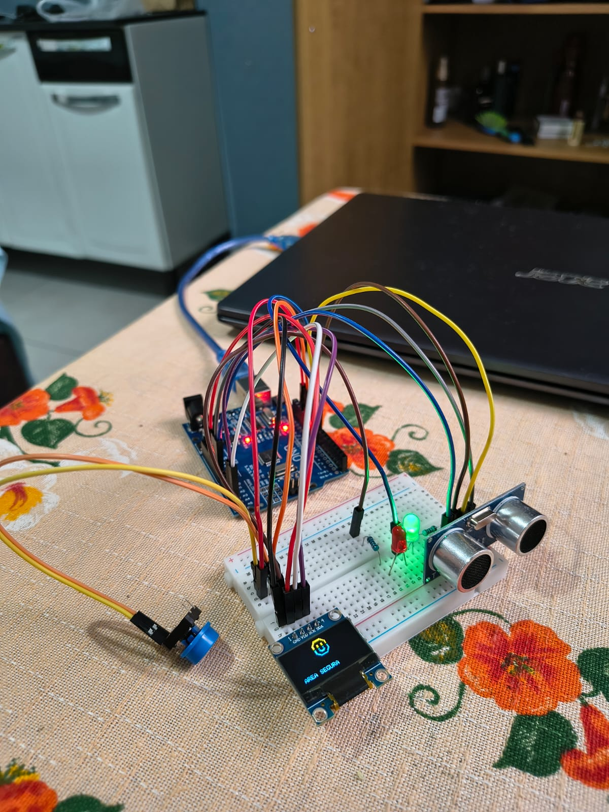
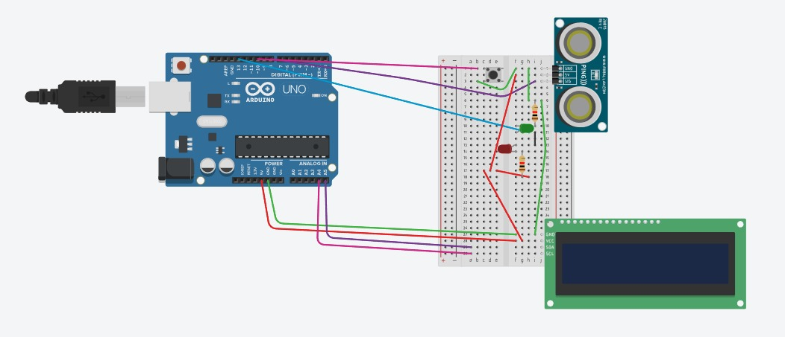

# Eletronica-USP
Repositório para guardar informações sobre os projetos para disciplina de Eletronica para Computação USP.

***Obs:*** Você pode entrar em cada pasta para acessar cada um individualmente.

### Integrantes
Gabriel Augusto Pereira Maia - 18117372 <br>
Chrystian Eloy de Assunção - 18115512

--- 

<br> <br>

# Fonte Ajustavel
Projeto de uma fonte ajustável para disciplina Eletrônica para Computação USP

## Sobre
Este projeto é um sistema desenvolvido para a disciplina de Eletrônica para Computação na USP - São Carlos. O objetivo é montar uma fonte com tensão ajustável entre 3V e 12V, com capacidade de corrente de até 100mA.

## Circuito no Falstad


## Escolha dos componentes:
| Quantidade | Componentes        | Valor Unitário R$ | Valor Total R$ |
|------------|--------------------|----------|----------|
| 1 | Protoboard | 23,80 | 23,80 |
| 1 | Ponte Retificadora | 4,10 | 4,10 |
| 2 | Capacitor 470uF | 2,80 | 5,60 |
| 1 | Potenciômetro 10k | 7,00 | 7,00 |
| 2 | Transistor NPN | 2,60 | 5,20 |
| 2 | Diodo Zener 13V | 0,50 | 1,00 |
| 10 | Diodo 1N4007 | 0,20 | 2,00 |
| 3 | Resistor 2W 100R | 1,20 | 3,60 |
| 10 | Resistor 1K5 | 0,07 | 0,70 |
| 10 | Resistor 4K7 | 0,07 | 0,70 |
| **Total**  |                    |  | **R$ 53,70** |

## PCB no Eagle


## Esquemático no Eagle


## Vídeo do Projeto 

<div align="center">
  <video width="320" height="240" controls>
    <source src="FonteAjustavel/midia/video.mp4" type="video/mp4" />
  </video>
</div>   

## Cálculos

### Parâmetros da Fonte e Relação de Espiras (RTC)

Para simular o circuito, determinamos a relação de transformação do transformador (**Trafo 1**) com base na tensão de pico da rede e na tensão desejada no filtro.

* **Tensão na tomada:** $V_{\text{máx}} = 180\text{ V} \implies V_{\text{RMS}} = 127\text{ V}$
* **Tensão desejada no capacitor:** $V_{\text{cap}} = 24.2\text{ V}$

Considerando a queda de tensão de dois diodos na retificação em ponte ($\approx 1.4\text{ V}$), a fórmula para a Relação de Transformação Completa (RTC) é:

$$\text{RTC} = \frac{V_{\text{máx}}}{V_{\text{cap}} + V_{\text{diodos}}}$$

Substituindo os valores:

$$\text{RTC} = \frac{180}{24.2 + 1.4} = \frac{180}{25.6} \approx 7.04$$

---

### Cálculo dos Resistores

#### LED
* **Corrente nominal do LED ($I_{\text{led}}$):** $5\text{ mA} = 5 \times 10^{-3}\text{ A}$
* **Cálculo da resistência:** $$R_{\text{led}} = \frac{V_{\text{cap}}}{I_{\text{led}}} = \frac{24.2}{5 \times 10^{-3}} = 4840\,\Omega$$

* **Componente comercial sugerido:** **$4.7\text{ k}\Omega$ — $\frac{1}{4}\text{ W}$**

#### Diodo Zener ($13\text{ V}$ — $1\text{ W}$)
* **Potência de operação adotada:** $0.125\text{ W}$
* **Corrente no Zener ($I_{\text{zener}}$):** $$I_{\text{zener}} = \frac{P_{\text{zener}}}{V_{\text{zener}}} = \frac{0.125}{13} \approx 9.62\text{ mA}$$

* **Cálculo do resistor de polarização:** $$R_{\text{zener}} = \frac{V_{\text{zener}}}{I_{\text{zener}}} = \frac{13}{9.62 \times 10^{-3}} \approx 1351\,\Omega$$

* **Componente comercial sugerido:** **$1.5\text{ k}\Omega$ — $\frac{1}{4}\text{ W}$**

#### Potenciômetro
* **Potenciômetro:** **$10\text{ k}$**
* **Resistência em série:** Calculada via simulador *Falstad* para garantir uma faixa de saída próxima a $3\text{ V}$ quando o potenciômetro estiver no ajuste máximo de $10\text{ k}\Omega$.
  * **Componente comercial sugerido:** **$4.7\text{ k}\Omega$ — $\frac{1}{4}\text{ W}$**

### Transistor NPN - 2N2222A 
* **Transistor utilizado:** **2N2222A ($\frac{1}{2}\text{ W}$)**
* **Resistência no Coletor:** Ajustada via *Falstad* para manter a estabilidade na faixa de $12\text{ V}$.
  * **Valor máximo permitido:** **$100\,\Omega$ — $2\text{ W}$**
* **Resistência de Carga (Simulação de Saída):** Para que a saída forneça uma corrente constante de $100\text{ mA}$.

$$R_{\text{carga}} = \frac{12\text{ V}}{100\text{ mA}} = 120\,\Omega$$

  * **Componente comercial sugerido:** **$120\,\Omega$ — $2\text{ W}$**

---

### Ripple e Capacitor

O dimensionamento do capacitor foi feito assumindo um *ripple* máximo tolerável de **10%** e uma resistência equivalente do circuito ($R_{\text{eq}}$) de $220\,\Omega$.

* **Frequência da rede retificada em onda completa ($f$):** $120\text{ Hz}$
* **Tensão de Ripple ($V_{\text{ripple}}$):** $10\% \text{ de } 180\text{ V} = 18\text{ V}$

A equação do capacitor de filtro é dada por:

$$C = \frac{V_{\text{máx}}}{f \times V_{\text{ripple}} \times R_{\text{eq}}}$$

Substituindo os valores do projeto:

$$C = \frac{180}{120 \times 18 \times 220}$$

$$C = \frac{180}{475200} \approx 378.38\,\mu\text{F}$$

* **Componente comercial sugerido:** **$470\,\mu\text{F}$ — $50\text{ V}$**

<br>

---
---
---
---
---

<br>

# Detector de Inimigos
Projeto livre desenvolvido com Arduino, utilizando tanto software quanto hardware. Ele inclui o código feito na Arduino IDE, o circuito com todas as conexões, imagens do protótipo montado e um vídeo mostrando como o sistema funciona.

## Sobre
O projeto desenvolvido consiste em um detector de inimigos utilizando Arduino. O sistema faz uso de um sensor de proximidade para identificar objetos ou pessoas que estejam próximas. Quando um inimigo é detectado, um painel de LEDs é acionado para indicar sua presença e alertar o usuário sobre o momento de ataque.

## Foto do Projeto


## Tinkercard



## Escolha dos componentes:
| Quantidade | Componentes        | Valor Unitário R$ | Valor Total R$ |
|------------|--------------------|----------|----------|
| 1 | Kit Arduino | 50 | 50 |
| 1 | Display | 22,48 | 22,48 |
| 1 | Sensor Ultrassônico | 19 | 19 |
| **Total**  |                    |  | **R$ 91,48** |

**Obs**: o Kit Arduino incluia leds, botões, resistores, placa, arduino, cabos, entre outros componentes.

## Vídeo do Projeto 

<div align="center">
  <video width="320" height="240" controls>
    <source src="DetectorInimigos/midia/video.mp4" type="video/mp4" />
  </video>
</div>   

## Código feito no Arduino IDE

``` // SCK: A4; SDA: A5; TRIG: D8; ECHO: D9; BOTÃO: D10; LED: D11

#include <Wire.h>
#include <Adafruit_GFX.h>
#include <Adafruit_SSD1306.h>

#define SCREEN_WIDTH 128
#define SCREEN_HEIGHT 64

Adafruit_SSD1306 display(SCREEN_WIDTH, SCREEN_HEIGHT, &Wire, -1);

const unsigned char feliz[] PROGMEM={
0x00,0x00,0x00,0x00,0x00,0x00,0x00,0x00,0x00,0x7F,0xFE,0x00,0x00,0x7F,0xFE,0x00,
0x00,0xFF,0xFF,0x80,0x01,0xC0,0x01,0x80,0x01,0xC0,0x01,0xC0,0x07,0x00,0x00,0x60,
0x07,0x00,0x00,0x60,0x1C,0x00,0x00,0x18,0x1C,0x00,0x00,0x18,0x1C,0x1C,0x1C,0x18,
0x1C,0x1C,0x1C,0x18,0x1C,0x1C,0x1C,0x18,0x1C,0x1C,0x1C,0x18,0x1C,0x1C,0x1C,0x18,
0x1C,0x1C,0x1C,0x18,0x1C,0x18,0x18,0x18,0x1C,0x00,0x00,0x18,0x1C,0x1C,0x18,0x18,
0x1C,0x1C,0x1C,0x18,0x1C,0x1F,0xFC,0x18,0x1C,0x07,0xF0,0x18,0x1C,0x07,0xF0,0x78,
0x07,0x00,0x00,0x60,0x07,0x00,0x01,0xE0,0x01,0xC0,0x01,0x80,0x01,0xC0,0x01,0x80,
0x00,0x7F,0xFE,0x00,0x00,0x7F,0xFE,0x00,0x00,0x00,0x00,0x00,0x00,0x00,0x00,0x00,
};

const unsigned char neutro[] PROGMEM={
0x00,0x00,0x00,0x00,0x00,0x00,0x00,0x00,0x00,0x00,0x04,0x00,0x00,0x3F,0xFE,0x00,
0x00,0x7F,0xFE,0x00,0x00,0xC0,0x03,0x80,0x00,0xC0,0x03,0x80,0x03,0x00,0x00,0xC0,
0x03,0x00,0x00,0xC0,0x0E,0x00,0x00,0xF0,0x0C,0x00,0x00,0x30,0x0C,0x1C,0x18,0x30,
0x0C,0x1C,0x18,0x30,0x0C,0x1C,0x18,0x30,0x0C,0x1C,0x38,0x30,0x0C,0x1C,0x18,0x30,
0x0E,0x1C,0x18,0x30,0x0C,0x1C,0x18,0x30,0x0C,0x00,0x00,0x30,0x0C,0x0F,0xF0,0x30,
0x0E,0x1F,0xF8,0x30,0x0C,0x1F,0xF8,0x30,0x0C,0x00,0x00,0x30,0x0C,0x00,0x00,0x30,
0x03,0x00,0x00,0xC0,0x03,0x00,0x00,0xC0,0x00,0xC0,0x03,0x80,0x00,0xC0,0x03,0x80,
0x00,0xFF,0xFF,0x00,0x00,0x3F,0xFE,0x00,0x00,0x3F,0xFC,0x00,0x00,0x00,0x00,0x00,
};


const unsigned char duvida[] PROGMEM = {
  0x00, 0x00, 0x00, 0x00, 0x00, 0x1F, 0xE0, 0x00, 0x00, 0x60, 0x18, 0x00, 0x01, 0x80, 0x06, 0x00,
  0x02, 0x00, 0x01, 0x00, 0x04, 0x7C, 0x0F, 0x40, 0x08, 0x82, 0x00, 0x20, 0x08, 0x00, 0x00, 0x20,
  0x10, 0x78, 0x07, 0x90, 0x10, 0x78, 0x07, 0x90, 0x10, 0x00, 0x00, 0x10, 0x10, 0x00, 0x00, 0x10,
  0x10, 0x0F, 0xF8, 0x10, 0x10, 0x00, 0x00, 0x10, 0x08, 0x00, 0x00, 0x20, 0x08, 0x00, 0x00, 0x20,
  0x04, 0x00, 0x00, 0x40, 0x02, 0x00, 0x00, 0x80, 0x01, 0x80, 0x03, 0x00, 0x00, 0x60, 0x0C, 0x00,
  0x00, 0x1F, 0xF0, 0x00, 0x00, 0x00, 0x00, 0x00, 0x00, 0x00, 0x00, 0x00, 0x00, 0x00, 0x00, 0x00,
  0x00, 0x00, 0x00, 0x00, 0x00, 0x00, 0x00, 0x00, 0x00, 0x00, 0x00, 0x00, 0x00, 0x00, 0x00, 0x00,
  0x00, 0x00, 0x00, 0x00, 0x00, 0x00, 0x00, 0x00, 0x00, 0x00, 0x00, 0x00, 0x00, 0x00, 0x00, 0x00
};

const unsigned char raiva[] PROGMEM = {
  0x00, 0x00, 0x00, 0x00, 0x00, 0x1F, 0xE0, 0x00, 0x00, 0x60, 0x18, 0x00, 0x01, 0x80, 0x06, 0x00,
  0x02, 0x00, 0x01, 0x00, 0x04, 0x00, 0x00, 0x80, 0x08, 0x78, 0x1E, 0x40, 0x08, 0x0C, 0x30, 0x40,
  0x10, 0x06, 0x60, 0x20, 0x10, 0x1E, 0x78, 0x20, 0x10, 0x1E, 0x78, 0x20, 0x10, 0x00, 0x00, 0x20,
  0x10, 0x00, 0x00, 0x20, 0x10, 0x0F, 0xF0, 0x20, 0x10, 0x08, 0x10, 0x20, 0x08, 0x10, 0x08, 0x40,
  0x08, 0x00, 0x00, 0x40, 0x04, 0x00, 0x00, 0x80, 0x02, 0x00, 0x01, 0x00, 0x01, 0x80, 0x06, 0x00,
  0x00, 0x60, 0x18, 0x00, 0x00, 0x1F, 0xE0, 0x00, 0x00, 0x00, 0x00, 0x00, 0x00, 0x00, 0x00, 0x00,
  0x00, 0x00, 0x00, 0x00, 0x00, 0x00, 0x00, 0x00, 0x00, 0x00, 0x00, 0x00, 0x00, 0x00, 0x00, 0x00,
  0x00, 0x00, 0x00, 0x00, 0x00, 0x00, 0x00, 0x00, 0x00, 0x00, 0x00, 0x00, 0x00, 0x00, 0x00, 0x00
};

void mostrarTela(const unsigned char *img, const char *texto) {
  display.clearDisplay();

  display.drawBitmap(
    48, 0,      // x, y
    img,
    32, 32,     // largura, altura
    SSD1306_WHITE
  );

  display.setTextSize(1);
  display.setTextColor(SSD1306_WHITE);
  display.setCursor(10, 50);
  display.println(texto);

  display.display();
}


const int trigPin = 8;
const int echoPin = 9;
const int buttonPin = 12;
const int ledPin = 11;

bool sistemaLigado = false;
bool ultimoEstadoBotao = HIGH;


void mostrarMensagem(String linha1, String linha2 = "") {
  display.clearDisplay();

  display.setTextSize(1);
  display.setTextColor(SSD1306_WHITE);

  display.setCursor(0, 20);
  display.println(linha1);

  if (linha2 != "") {
    display.setCursor(0, 40);
    display.println(linha2);
  }

  display.display();
}

float medirDistancia() {
  digitalWrite(trigPin, LOW);
  delayMicroseconds(2);

  digitalWrite(trigPin, HIGH);
  delayMicroseconds(10);
  digitalWrite(trigPin, LOW);

  long duracao = pulseIn(echoPin, HIGH, 30000);

  if (duracao == 0) {
    return 999.0; // sem eco recebido
  }

  return duracao * 0.0343 / 2.0;
}

void setup() {
  pinMode(trigPin, OUTPUT);
  pinMode(echoPin, INPUT);

  pinMode(buttonPin, INPUT_PULLUP);

  pinMode(ledPin, OUTPUT);
  digitalWrite(ledPin, LOW);

  Wire.begin();

  if (!display.begin(SSD1306_SWITCHCAPVCC, 0x3C)) {
    while (true); // trava se OLED não iniciar
  }

  display.clearDisplay();
  display.display();

  mostrarMensagem("SISTEMA", "DESLIGADO");
}

void loop() {

  bool estadoBotao = digitalRead(buttonPin);

  if (ultimoEstadoBotao == HIGH && estadoBotao == LOW) {

    sistemaLigado = !sistemaLigado;

    digitalWrite(ledPin, sistemaLigado ? HIGH : LOW);

    if (sistemaLigado) {
      mostrarMensagem("SISTEMA", "ATIVADO");
    } else {
      mostrarMensagem("SISTEMA", "DESLIGADO");
    }

    delay(50);
  }

  ultimoEstadoBotao = estadoBotao;

  if (!sistemaLigado) {
    delay(50);
    return;
  }

  float distancia = medirDistancia();

  static int estadoAnterior = -1;
  int estadoAtual;

  if (distancia <= 5.0) {
    estadoAtual = 0;
  }
  else if (distancia <= 15.0) {
    estadoAtual = 1;
  }
  else if (distancia <= 25.0) {
    estadoAtual = 2;
  }
  else {
    estadoAtual = 3;
  }

  if (estadoAtual != estadoAnterior) {

    estadoAnterior = estadoAtual;

    switch (estadoAtual) {

      case 0:
        mostrarTela(raiva, "ATAQUE!");
        break;

      case 1:
        mostrarTela(duvida, "INIMIGO PROXIMO");
        break;

      case 2:
        mostrarTela(neutro, "INIMIGO AVISTADO");
        break;

      case 3:
        mostrarTela(feliz, "AREA SEGURA");
        break;
    }
  }

  delay(100);
}
```